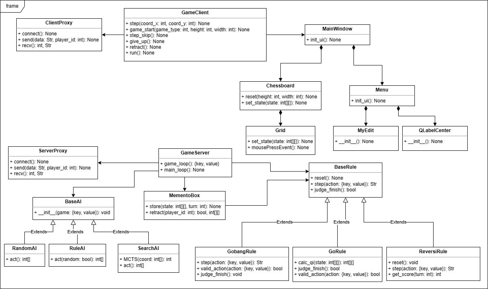

# 2023214309 吴禹 大作业第二阶段实验报告

## 视频和仓库链接

- 第二阶段演示视频：https://cloud.tsinghua.edu.cn/f/cc6ed759755441299392/
- Git仓库：https://github.com/YARNELLL/OOP_Large_Homework

## 设计思路

+ 按照大作业的要求，即图形界面和游戏逻辑相分离的设计思路，本项目采用了Client/Server结构，也就是客户端/服务器结构。
+ 客户端：根据当前游戏状态生成游戏界面，读取用户操作，通过会话链接发送给服务器
+ 服务器：接收来自客户端的信息，处理对应的游戏逻辑，包括处理非法信息，判断游戏输赢，初始化一局游戏等等，将处理后的游戏状态发送回客户端
+ 图形界面：使用pyqt5库来实现
+ AI功能：包括随机AI、规则AI和蒙特卡洛搜索AI
+ 用户账户管理：存储在本地文件里，服务器负责读取用户信息到游戏状态里

## 设计模式

代理模式，工厂模式，单例模式，状态模式，观察者模式，命令模式，策略模式，责任链模式，模板模式

## 关键类和函数功能说明

### 客户端：

- client.py文件
  - GameClient类：客户端类
    - step函数：发送下一步操作坐标指令
    - game_start函数：发送游戏开始指令
    - step_skip函数：发送跳过当前轮次指令
    - give_up函数：发送放弃游戏指令
    - retract函数：发送反悔指令
    - ai_act函数：发送使用AI走下一步棋指令
    - run函数：判断服务器发送来的指令类型，执行相应的前端反馈
- gui.py文件
  - Grid类：前端渲染格子的类
    - set_state函数：判断当前格子的状态，渲染对应的棋子
    - mousePressEvent函数：获取鼠标点击信息
  - Chessboard类：前端渲染棋盘的类
  - Menu类：前端渲染菜单的类
  - MainWindow类：前端渲染整个游戏界面的类
- proxy.py文件
  - ClientProxy类：负责跟服务器的通信
    - connect函数：根据主机和端口号建立连接
    - send函数：基本发送信息功能
    - send_game_info函数：发送游戏信息
    - send_step函数：发送当前步信息
    - send_give_up函数：发送放弃信息
    - send_retract函数：发送反悔信息
    - send_ai_act函数：发送AI行动信息
    - send_name函数：发送当前用户信息
    - recv函数：基本接收信息功能

### 服务器：

- ai.py文件
  - BaseAI类：基础AI类
  - RandomAI类：随机下子的AI类，需要遵守下棋规则
  - RuleAI类：使用规则来判断最佳下子点的AI类
  - SearchAI类：使用规则和搜索树来判断最佳下子点的AI类
- rule.py文件
  - MementoBox类：备忘录，记录之前的局势
  - BaseRule类：基础的下棋规则，比如不能下在有子的地方以及棋盘以外的地方
  - GobangRule类：五子棋的下棋规则
  - GoRule类：围棋的下棋规则
    - calc_qi函数：计算每个棋子的气，需要把没气的棋子拿掉
  - ReversiRule类：黑白棋的下棋规则
- proxy.py文件
  - ServerProxy类：负责跟客户端进行通信
- userData.py文件
  - UserData类：存储用户信息，包括用户名以及该用户的胜利场次

## UML图

